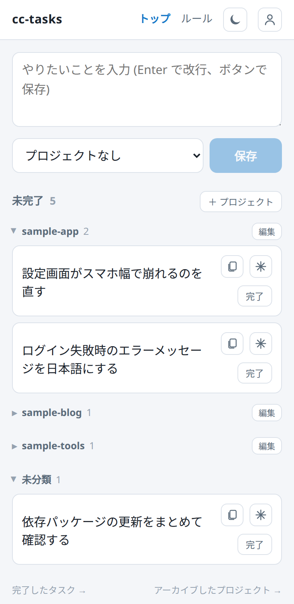
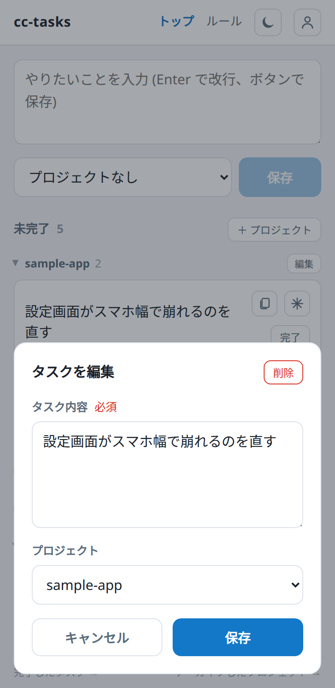
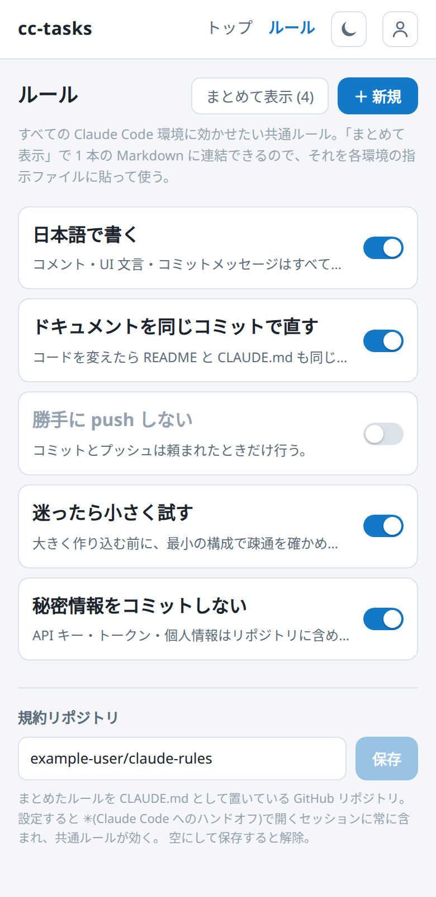

# CC Tasks — Claude Code タスクメモ

Claude Code に依頼したいタスクをメモ・管理する、利用者 1 人向けの Web アプリ。やりたいことは 2 つだけ:

- **Claude Code への依頼の思いつきをメモで残す** —— 出先でスマホ(PWA)から放り込み、腰を据えて作業できるときに消化する
- **Claude Code に守らせたいルールを 1 箇所で管理する** —— まとめて 1 本の Markdown として取り出し、貼り付けて戻せる

設計の詳細(画面・操作、データモデル、API)は [docs/詳細設計.md](docs/詳細設計.md) にまとめてある。

## 使い方の流れ

出先で思いついたら開いてメモを一言残す → 作業できるときにカードの ✳ ボタンで **Claude Code をそのまま開いて**
消化する(またはメモをコピーして貼る)→ 終わったらメモを **完了** にする、という素早い運用を想定。

扱うものは 3 つだけ:

| | 中身 | どこで | ポイント |
|---|---|---|---|
| **タスク** | Claude Code に依頼したいこと(数行のメモ) | トップで入力・一覧、完了分は `/done` | 状態は **未着手 / 着手中 / 完了**(着手中 = 依頼済みだが動作確認待ち)。カードの ✳ から Claude Code へハンドオフ。未完了分は**書き出して戻せる**(→ [タスクのバックアップ](#タスクのバックアップ)) |
| **プロジェクト** | タスクの入れ物(リポジトリ 1 つに対応する想定) | トップ(専用画面は無い) | 紐づけは**任意**。未紐づけは「未分類」として一覧の末尾(トップでは 0 件でも出る)。片付いたらアーカイブ |
| **ルール** | 全 Claude Code 環境に効かせたい決まりごと(Markdown) | ルール画面 | 有効なものを表示順に **1 本へ連結**してコピーし、各環境の指示ファイルに貼る。**規約リポジトリ**を設定すると ✳ で開くセッションに常に含まれる(→ [ルールを Claude Code に効かせる](#ルールを-claude-code-に効かせる)) |

主な操作:

| したいこと | どうする |
|---|---|
| タスクを放り込む | トップ上部に入力して保存(プロジェクトは選んでも選ばなくてもよい) |
| Claude Code で消化する | カードの **✳**(内容をプリフィルして `claude.ai/code` を開く)。**📋** は本文コピー |
| 編集・削除する | **カードの本文を押す**とモーダル。削除もここから(誤タップ防止で一覧には置かない) |
| 状態(未着手 / 着手中 / 完了)を切り替える | カードのボタンから(モーダルに状態の選択は無い) |
| 並び替える・別プロジェクトへ移す | 行を**長押ししてからドラッグ**。グループ見出しならプロジェクトの並び。「未分類」へ落とせば紐づけが外れる |
| プロジェクトを作る・編集する | 「未完了」見出しの **＋ プロジェクト** / 各グループ見出しの **編集** |
| プロジェクトを片付ける | 編集モーダルからアーカイブ(**未完了 0 件のときだけ**)。削除はアーカイブ済みのときだけ |
| 再読み込みする | 画面を**下に引っ張る**(PWA にはリロード手段が無いため) |
| タスクを持ち出す・戻す | 「未完了」見出しの **バックアップ**(モーダル内のタブで書き出し / 読み込み。→ [タスクのバックアップ](#タスクのバックアップ)) |

画面ごとの詳しい挙動・制約は [docs/詳細設計.md](docs/詳細設計.md) にまとめてある。

## タスクのバックアップ

「未完了」見出しの右の**バックアップ**から、未完了タスクを**プロジェクト名と
リポジトリ付きで JSON に書き出せる**。書き出した内容はそのまま「読み込み」に戻せるので、
保存しておけばバックアップになり、別の環境への引っ越しにも使える。
向き(書き出し / 読み込み)はモーダル内のタブで切り替える。

- 持ち出し方は**コピーとファイル**の 2 つ(中身はどちらも同じ)。コピーは本文の枠の中の
  右上のアイコン、ファイルは**文言のままのボタン**(書き出しは枠のすぐ外の右上、
  読み込みは「書き出した内容」の見出しと同じ行の右端)。閉じるはモーダル右上の ×
- プロジェクトは**名前で照合し、無ければ作る**(リポジトリ URL も一緒に登録する)。既にあるものは触らない
- **同じタイトルの未完了タスクが既にあれば飛ばす**ので、二度読み込んでも増えない
- 読み込む前に「作るプロジェクト / 作るタスク / 飛ばすタスク」の一覧が出る
- 含まないもの: 完了タスク、プロジェクトの説明・並び順・アーカイブ状態

## スクリーンショット

| トップ(未完了) | 編集モーダル | ルール |
|---|---|---|
|  |  |  |

<sub>ローカル dev(認証なし)に架空のサンプルデータ(`sample-*`)を入れて撮ったもの。</sub>

## 構成

| レイヤ | 技術 |
|---|---|
| バックエンド | Java 25 / Spring Boot 4.1 / Spring Data JDBC / SQLite |
| フロントエンド | Vue 3 / Vite / TypeScript / Pinia / vite-plugin-pwa |
| 配信 | マルチステージ Docker ビルドで単一コンテナ |

```
[スマホ/ブラウザ PWA]
   Google OAuth セッション
            |
   リバースプロキシ (TLS 終端)
            |
  Spring Boot (単一コンテナ)
    /         → Vue SPA
    /api/**   → REST (要セッション)
    SQLite: /data/cctasks.db
```

## 起動

### ローカル開発(ホットリロード)

```bash
./dev.sh
```

backend(dev プロファイル / **認証なし**)+ 継続コンパイル + フロント(Vite HMR)を
まとめて起動する。ブラウザで開くのは **`http://localhost:7000`**。

- フロント: 保存で即 HMR
- バックエンド: 保存 → 再コンパイル → devtools が数秒で自動再起動
- dev プロファイルは認証を通さないので**ログイン不要**

個別に起動する場合:

```bash
# backend (:7001)。継続コンパイルを別ターミナルで回すと保存時に自動再起動する
cd backend && ./gradlew bootRun --args='--spring.profiles.active=dev'
cd backend && ./gradlew -t classes          # 別ターミナル

# frontend (:7000)。/api を :7001 にプロキシ
cd frontend && npm install && npm run dev
```

> Docker を毎回リビルドして確認すると遅く、ホットリロードも効かない。
> 反復は上記の dev ループで行い、Google ログイン込みで確認したいときだけ
> `docker compose` を使う(セッションは永続化されるので再起動しても再ログイン不要)。

### 本番運用(GHCR から pull するだけ)

イメージは **GitHub Actions が `main` への push でビルドし GHCR へ公開**する
([.github/workflows/docker-publish.yml](.github/workflows/docker-publish.yml))。
本番サーバーはビルドせず、リポジトリ(compose.yaml と .env)だけ置いて pull する。

```bash
cp .env.example .env    # 初回のみ。値を埋める

# リポジトリが非公開(=GHCR イメージも非公開)の間は初回だけ GHCR にログイン。
# read:packages 権限の PAT を使う。リポジトリを公開しパッケージも public にすれば不要。
echo "$GHCR_TOKEN" | docker login ghcr.io -u <github-user> --password-stdin

# 更新はこれだけ
docker compose pull && docker compose up -d
```

- `compose.yaml` は `127.0.0.1:7000` にだけ公開する。HTTPS 終端と外部公開は手前のリバースプロキシの責務
- タグは `latest` と `sha-xxxxxxx`。切り戻しは `CCTASKS_IMAGE=ghcr.io/rtcode337/cc-tasks:sha-xxxxxxx docker compose up -d`
- データ(SQLite・セッション)は**リポジトリ直下の `data/`** に残るので、pull・再作成しても消えない。
  **バックアップ・別マシンへの移行はこのフォルダごとコピーすればよい**(停止してからコピーすること)
- `data/` に書き込むユーザーは既定で `1000:1000`。`id -u` が 1000 以外のホストでは
  `.env` に `CCTASKS_UID` / `CCTASKS_GID` を設定する。所有者合わせは起動前に
  `cctasks-init` が自動でやるので、`chown` を手で打つ必要はない

### `.env` を置けない環境へ入れる

管理画面に YAML を貼り付けて起動するタイプの環境では、`.env` もシェルの環境変数も無いため
`${...}` が解決できない。この場合は値を YAML に直接書いた単体定義を使う:

```bash
cp compose.standalone.example.yaml compose.standalone.yaml   # コピー先は .gitignore 済み
```

先頭の 3 ブロック(設定・データの置き場・実行ユーザー)を実値に置き換えて貼り付ける。
**シークレットを含むのでコピーした側はコミットしないこと。**

### ローカルでイメージをビルドして確認

本番同等(Google ログイン込み)を手元で試すとき:

```bash
cp .env.example .env
docker compose -f compose.build.yaml up -d --build
```

> 普段の反復は `./dev.sh`(ホットリロード)で十分。Docker は本番同等確認のときだけ使う。

### 環境変数

| 変数 | 用途 |
|---|---|
| `GOOGLE_CLIENT_ID` / `GOOGLE_CLIENT_SECRET` | Google OAuth クレデンシャル |
| `ALLOWED_EMAIL` | ログインを許可する Google アカウント (1 件) |
| `DB_PATH` | SQLite ファイルパス (既定 `/data/cctasks.db`) |
| `PUBLIC_BASE_URL` | **任意**。OAuth リダイレクトは未設定ならリクエストから自動導出する。プロキシが `X-Forwarded-*` を送らない場合のみ設定 |
| `TZ` | **任意**。表示・ログのタイムゾーン (既定 `Asia/Tokyo`) |
| `CCTASKS_UID` / `CCTASKS_GID` | **任意**。`data/` に書き込むユーザー (既定 `1000:1000`) |

Google Cloud Console 側の「承認済みのリダイレクト URI」には
`<公開 URL>/login/oauth2/code/google` を登録する(`PUBLIC_BASE_URL` を設定すればその値が基点、
未設定ならプロキシ経由の実 URL)。セッション Cookie の `Secure` はリクエストのスキームから
自動判定される(https なら付与、http なら非付与)ので、http ローカル・https 本番のどちらでも動く。

> **https で公開しているのに `redirect_uri` が http になってログインできない場合**は、
> 手前のプロキシが `X-Forwarded-Proto` を送っていない(既定で付けない実装がある)。
> コンテナは HTTP しか受けないため、このヘッダが無いとスキームを復元できない。
> `.env` に `PUBLIC_BASE_URL=https://<公開ホスト>` を設定すれば、ヘッダ無しでも https で組む。

## ルールを Claude Code に効かせる

**ルール**画面で、全環境に効かせたい決まりごとを Markdown で何本でも書ける。
「まとめて表示」を押すと、有効なルールが表示順に 1 本の Markdown へ連結されるので、
それをコピーして各環境の指示ファイルに貼る。先頭には次の 2 つが自動で付く:

- 「特定リポジトリの説明ではなく作業対象のすべてのリポジトリに適用する共通ルール」という前置き
- 「規約リポジトリ(下記)自体は配布専用なので自動では更新しない。更新はユーザーが
  更新後の Markdown を明示的に渡したときだけ」というルール

| 環境 | 貼り先 | 有効範囲 |
|---|---|---|
| CLI 版 | `~/.claude/rules/cc-tasks.md` | マシン上の全リポジトリ |
| Web 版 | 規約リポジトリ(下記)のルート `CLAUDE.md` | ✳ 経由の全セッション |
| Web 版 (代替) | リポジトリの `.claude/rules/cc-tasks.md` | そのリポジトリ |

ユーザーレベルの設定はクラウドセッションに引き継がれないため、Web 版はリポジトリ経由で
届ける。ルール画面の一覧の下で**規約リポジトリ**(GitHub の `owner/repo` か URL)を
設定すると、✳(Claude Code へのハンドオフ)で開くセッションにそのリポジトリが常に含まれ、
ルート直下の CLAUDE.md が読み込まれる —— 連結ルールをそこに貼っておけば、
リポジトリごとに置いて回らなくてよい。プロンプトの先頭にも
「まず規約リポジトリの CLAUDE.md に従う」の一言が自動で付く。空にして保存すると解除。

逆に、**貼り先に残っている Markdown から一覧へ戻せる**(「取り込み」)。
`## 見出し` ごとに 1 本のルールに分解するので、DB を失っても打ち直さずに復旧できる
—— 貼り先の 1 本がそのままバックアップになる。既存を残して末尾に足すか、
全部消して入れ替えるかを選べ、実行前に取り込む見出しの一覧が出る。
まとめた Markdown はモーダル右上から**ファイルにも書き出せ**、取り込み側も
**ファイルから読み込める**(タスクのバックアップと同じ)。

ルールは**指示であって強制ではない**(CLAUDE.md と同じくシステムプロンプトの後の
ユーザーメッセージとして届く)。絶対に破らせたくない操作は Claude Code の
フック側で止めること。

## API

REST API の一覧と規約は [docs/詳細設計.md](docs/詳細設計.md#4-rest-api) 参照。

## テスト

```bash
cd backend  && ./gradlew test      # SQLite の型変換 / 並び替え / ルールとタスクの書き出しと取り込み
cd frontend && npm run typecheck
```

## ライセンス

[MIT License](LICENSE)
