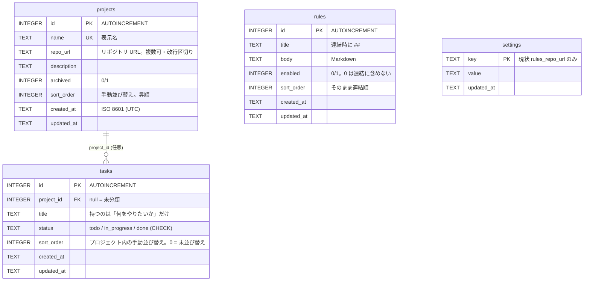
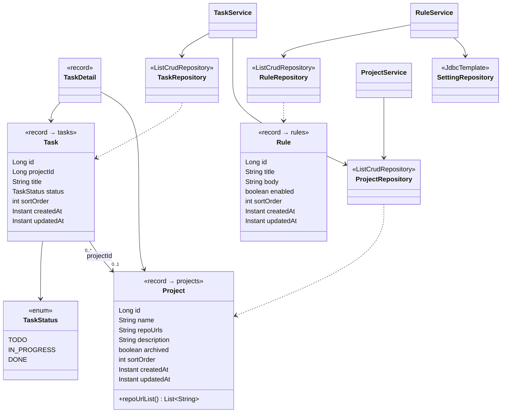

# データベース定義

SQLite のテーブル定義と、テーブル間の関係をまとめた文書。**DDL とマイグレーションを
往復しなくても最終形が分かるようにするため**に置いている。

定義の**権威は4か所**にあり、この文書はそれを読める形に写したもの:

| 何 | どこ |
|---|---|
| 新規 DB に流れる DDL | [backend/src/main/resources/schema.sql](../backend/src/main/resources/schema.sql) |
| 既存 DB への列追加・削除 | [`SchemaMigrations`](../backend/src/main/java/dev/cctasks/config/SchemaMigrations.java)(起動時の冪等な ALTER) |
| 列 ↔ Java の対応 | 各パッケージの record(`Project` / `Task` / `Rule`) |
| 型の変換規則 | [`JdbcConfig`](../backend/src/main/java/dev/cctasks/config/JdbcConfig.java) |

**DB に変更を入れたら、同じコミットでこの文書も更新する**(手順は末尾)。

## 全体像(ER 図)

`settings` はどのテーブルとも関係を持たない、アプリ全体のキーバリュー置き場。
**ユーザーテーブルは無い** —— 利用者は本人 1 名で、認証は Google OAuth のメールを
環境変数 `ALLOWED_EMAIL` と照合するだけ(詳細設計 §3)。セッションは DB ではなく
`SESSION_DIR`(`/data/sessions`)にファイルで永続化する。

## テーブル

### projects — タスクの入れ物(リポジトリ 1 つに対応する想定)

| 列 | 型 | 制約 | 意味 |
|---|---|---|---|
| `id` | INTEGER | PK, AUTOINCREMENT | |
| `name` | TEXT | NOT NULL, **UNIQUE** | 表示名 |
| `repo_url` | TEXT | | リポジトリ URL。**複数を改行区切りで 1 列に持つ**(マイグレーションツールが無いので列を増やさない)。入出力はリスト(`Project.repoUrlList()`) |
| `description` | TEXT | | |
| `archived` | INTEGER | NOT NULL, 既定 0 | 0/1 |
| `sort_order` | INTEGER | NOT NULL, 既定 0 | 手動並び替えの表示順(昇順)。同値は名前順 |
| `created_at` / `updated_at` | TEXT | NOT NULL | ISO 8601 (UTC) |

- 削除できるのは**アーカイブ済みのときだけ**、アーカイブできるのは**未完了タスクが 0 件のときだけ**(いずれもアプリ側の判定)
- 並びは `ORDER BY sort_order, name`

### tasks — Claude Code に依頼したいこと

| 列 | 型 | 制約 | 意味 |
|---|---|---|---|
| `id` | INTEGER | PK, AUTOINCREMENT | |
| `project_id` | INTEGER | `REFERENCES projects(id)` | **nullable** = 未分類。出先でメモだけ放り込み、後から紐づけるため |
| `title` | TEXT | NOT NULL | **タスクが持つ内容はこれだけ**(背景・受け入れ条件・スコープ外の列は廃止) |
| `status` | TEXT | NOT NULL, 既定 `todo`, CHECK | `todo` / `in_progress` / `done`。遷移に制約は設けない(手戻り・中止を許容) |
| `sort_order` | INTEGER | NOT NULL, 既定 0 | **プロジェクト内でだけ**効く表示順。0 = 未並び替えで、新規タスクはグループ先頭に積まれる |
| `created_at` / `updated_at` | TEXT | NOT NULL | ISO 8601 (UTC) |

- 索引 `idx_tasks_project_status (project_id, status)` —— 一覧はどれもこの 2 列で絞る
- 並びは「プロジェクトで絞ったときだけ `sort_order` → `created_at DESC, id DESC`」。
  **全体一覧では `sort_order` を使わない**(プロジェクトをまたいで番号が混ざると探しづらい)
- 並び替えの更新は `updated_at` を触らない(並び替えはタスクの「動き」ではないため)

### rules — 全 Claude Code 環境に効かせたい共通ルール

| 列 | 型 | 制約 | 意味 |
|---|---|---|---|
| `id` | INTEGER | PK, AUTOINCREMENT | |
| `title` | TEXT | NOT NULL | 見出し。連結時に `## <title>` になる |
| `body` | TEXT | NOT NULL | 本文(Markdown) |
| `enabled` | INTEGER | NOT NULL, 既定 1 | 0/1。外したルールは連結に含めない(消さずに一時的に外せる) |
| `sort_order` | INTEGER | NOT NULL, 既定 0 | 表示順がそのまま連結順 |
| `created_at` / `updated_at` | TEXT | NOT NULL | |

並びは `ORDER BY sort_order, id`。

### settings — アプリ全体のキーバリュー

| 列 | 型 | 制約 | 意味 |
|---|---|---|---|
| `key` | TEXT | PK | 現状は `rules_repo_url`(規約リポジトリ)だけ |
| `value` | TEXT | NOT NULL | |
| `updated_at` | TEXT | NOT NULL | |

**行が無い = 未設定**。Spring Data JDBC は文字列主キーだと `save` が常に UPDATE 扱いになり
upsert と相性が悪いため、ここだけ `JdbcTemplate` で `ON CONFLICT DO UPDATE` を直接書いている。

## テーブルとコードの対応(クラス図)

`settings` に対応する record は無い(値は `String` のまま `RuleService` が扱う)。
ロジックはすべて `*Service` にあり、コントローラは薄い(詳細設計 §1)。

## 型の約束

**SQLite には日時型も真偽型も無い**ので、Java 側との橋渡しを `JdbcConfig` のコンバータで
明示している。

| Java | DB | 変換 |
|---|---|---|
| `Instant` | TEXT | ISO 8601・UTC・ミリ秒精度(`uuuu-MM-dd'T'HH:mm:ss.SSS'Z'`) |
| `boolean` | INTEGER | 0/1 |
| `TaskStatus` | TEXT | `todo` / `in_progress` / `done` |

- **`Instant` の書き込みコンバータは `JdbcValue` を返す形でないと効かない。** 素直に
  `Converter<Instant, String>` を書くと Spring Data JDBC が先に列型を `java.sql.Timestamp` と
  決めてしまい、SQLite にエポックミリ秒が入る
- `SettingRepository` は `JdbcTemplate` 直書きなので、同じ書式の `DateTimeFormatter` を自前で持つ。
  **ずらすと日時の書式が 1 テーブルだけ変わる**

## 整合性と削除

- FK は宣言してあり、接続時に `foreign_keys=on` を渡している(`ON DELETE` は付けていない)
- **プロジェクトの削除は、紐づくタスクを同一トランザクションで先に消す**
  (`TaskRepository.deleteByProjectId`)。完了分も一緒に消える
- タスクの削除は物理削除

## 接続と置き場

- JDBC URL: `jdbc:sqlite:${DB_PATH:./data/cctasks.db}?foreign_keys=on&journal_mode=WAL&busy_timeout=5000&synchronous=NORMAL`
  - **WAL + `busy_timeout`** で「読み中に書けない」系のロック衝突を緩和する
  - **`synchronous=NORMAL`** は WAL 前提の割り切り(コミット毎の fsync をやめても DB は壊れない)。
    外すと低速なディスクで初回保存が数秒〜十数秒待ちに戻る。対になる `WriteWarmup` も同じ目的
- 本番はリポジトリ直下の `data/` を `/data` に bind マウントする。**バックアップは `data/` のコピー**
  (SQLite 本体・WAL・セッションが全部そこに入る)
- タスクとルールは画面から Markdown で書き出し/読み込みできる(`GET /api/tasks/export` と
  `POST /api/tasks/import`、ルールは `GET /api/rules/combined` と `POST /api/rules/import`)。
  **DB を失っても打ち直さずに戻せる**副次的なバックアップ経路

## 廃止済み(既存 DB からは `SchemaMigrations` が落とす)

| 対象 | いつ | 備考 |
|---|---|---|
| `notes` テーブル | 2026-07 | タスクの経緯タイムラインごと廃止(書き込み口だった MCP も廃止) |
| `tasks.context` / `acceptance_criteria` / `out_of_scope` | 2026-07 | 一度も埋まらないまま廃止。`DROP COLUMN`(SQLite 3.35+) |
| `tasks.status` の CHECK に `in_progress` が無い版 | 2026-07 | 着手中の復活に伴い、該当する DB はテーブルを作り直して差し替える(SQLite は CHECK だけを変更できない) |

## 変更するときの手順

1. `schema.sql` を直す(新規 DB 用)
2. `SchemaMigrations` に冪等な ALTER を足す(既存 DB 用)。**片方だけだと、手元では動いて
   本番の DB で落ちる**
3. record と、必要なら `JdbcConfig` のコンバータを直す
4. **この文書と [詳細設計.md](詳細設計.md) §2 を同じコミットで更新する**
